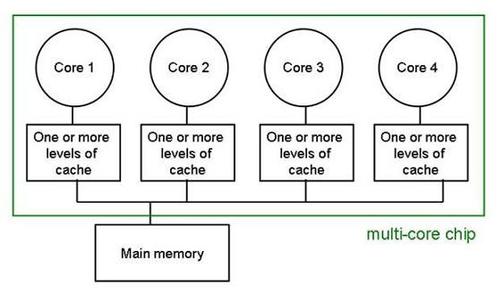

# Computación Concurrente - Coordinación entre Hilos

## Equipo de enseñanza
* Manuel Alcántara Juárez <manuelalcantara52@ciencias.unam.mx>
* Ricchy Alaín Pérez Chevanier <alain.chevanier@ciencias.unam.mx>

## Objetivo

Analizar e implementar mecanismos de coordinación entre hilos. También mediante 
ejemplos aplicarás un par de conceptos para lograr consistencia de memoria cuando 
más de un hilo escribe y lee en un espacio compartido de memoria.

## Introducción

Es importante considerar el factor _happens-before_ si se están desarrollando aplicaciones 
multiproceso en Java, para comprender cómo se manejan las variables compartidas dentro 
en la memoria.

Uno de los conceptos con los que se debe estar familiarizado es la _visibilidad_. Hoy en día, 
la mayoría de las computadoras cuentan con múltiples núcleos dentro de sus procesadores y cada 
uno de ellos es capaz de manejar múltiples hilos de ejecución. De tal forma que para cada núcleo 
existen varios niveles de caché tal como se muestra en la siguiente figura



Dicho lo anterior, la visibilidad de las operaciones de escritura en variables compartidas puede 
causar problemas durante los retrasos que ocurren al escribir en la memoria principal debido al 
almacenamiento en caché de cada núcleo. Esto puede resultar en que otro hilo lea un valor obsoleto 
(no el último valor actualizado) de la variable.

### Relación Happens-before

Si existe una relación _happens-before_ entre una operación de escritura y lectura, se garantiza 
que los resultados de una escritura de un hilo serán visibles para una lectura de otro hilo. Por 
lo tanto, seremos capaces de mantener la consistencia de la memoria si podemos tener la relación 
_happens-before_ entre las acciones.

La _sincronización_ se utiliza ampliamente para lograr exclusión mutua entre hilos, que en Java se 
define con la palabra reservada `synchronized`, con la cual se da la capacidad de limitar el acceso 
a un bloque de código en particular o a un método a un solo hilo. Cada hilo fuera del bloque 
`synchronized`, debe esperar hasta que el hilo dentro del bloque termine de ejecutarlo y lo libere.

Otra propiedad importante de `syncrhonized` es que ayuda a lograr una relación _happens-before_ 
entre bloques de código o métodos. Si hay dos bloques sincronizados que tienen el mismo bloqueo, 
existe una relación _happens-before_ entre las acciones dentro de los bloques de sincronización. 
Esto se debe al hecho de que un desbloqueo en un bloqueo de objeto ocurre antes de cada adquisición 
posterior del mismo bloqueo de objeto.

Los errores de consistencia de memoria ocurren cuando diferentes hilos tienen vistas inconsistentes 
de lo que deberían ser los mismos datos. Para evitar estos errores, es importante considerar y 
entender la relación _happens-before_ en esta práctica.

### Campos volátiles

Otra forma de lograr una relación _happens-before_ es con la escritura de una variable con el 
modificador volátil, ya que cada escritura a una variable con este modificador establece una relación
_happens-before_ con cada lectura posterior, incluso si suceden en distintos hilos.

En Java se utiliza la palabra reservada _volatile_ para crear una variable volátil. Es importante 
resaltar que la palabra reservada _volatile_ no reemplaza los bloques o métodos sincronizados. 
Este será útil únicamente cuando se quiera lograr visibilidad para las variables compartidas que 
son leídas y escritas por diferentes hilos.

Lo anterior implica que aún será necesario utilizar la sincronización cuando se requiera lograr exclusión
mutua entre hilos.

Además de la sincronización y la volatilidad, Java define varias reglas para lograr una relación 
_happens-before_, que puedes consultar en 
[Oracle Docs](https://docs.oracle.com/javase/specs/jls/se8/html/jls-17.html#jls-17.4.5).


## Desarrollo
En esta práctica trabajarás con una base de código construida con Java 11 y Maven Wrapper,
también proveemos pruebas unitarias escritas con la biblioteca **Junit 5.7.2** que te
darán retrospectiva inmediatamente sobre el funcionamiento de tu implementación.

Para ejecutar las pruebas necesitas ejecutar el siguiente comando:

```
$ ./mvnw test
```

Para ejecutar las pruebas contenidas en una única clase de pruebas, utiliza
un comando como el siguiente:

```
$ ./mvnw -Dtest=MyClassTest test
```

En el código que recibirás la clase **App** tiene un método __main__ que puedes ejecutar
como cualquier programa escrito en __Java__. Para eso primero tienes que empaquetar
la aplicación y finalmente ejecutar el jar generado. Utiliza un comando como el que
sigue:

```
$ ./mvnw package
... o saltando las pruebas unitarias
$ ./mvnw package -DskipTests
...
...
$ ./mvnw exec:java 
```

## Configuración de los git hooks para formatear el código

Antes de empezar a realizar commits que contenga tu solución
tienes que configurar un módulo de git que te ayudará a
formatear tu código.

```
./mvnw git-code-format:install-hooks
```

## Forma de trabajo

Recomendamos ampliamente utilizar el editor [IntelliJ](https://www.jetbrains.com/help/idea/installation-guide.html)
para realizar el desarrollo de la práctica.
También agrega el plugin de IntelliJ [SonarLint](https://www.sonarsource.com/products/sonarlint/features/jetbrains/).

## Entrega

Deja todo el código con tu solución en la rama __main__, pues por omisión es esta
rama la que compara __Github Classroom__ contra la versión inicial del código mediante
el __Pull Request__ llamado __Feedback__, el cual nosotros vamos a revisar
para evaluar tu entrega.

Para verificar que tu código cumple con la especificación,
en tu __Pull Request__ debes de pasar las dos validaciones que
hace __Github Actions__ sobre el código, una de ellas verifica
que pasas las pruebas automatizadas, y la otra que hayas formateado
tu código con el plugin de maven.

Además, no olvides marcar en classroom la tarea como entregada y
en ella incluir el enlace hacia el __Pull Request__ que contiene tu
solución.

La fecha de entrega de tu práctica va a ser el máximo entre la fecha en la que
abriste el __Pull Request__ y la fecha en la que hiciste el último push al repositorio con tu
solución.


## Actividades

### [PROBLEMA 1] Algoritmo de Peterson

Para esta actividad tienes que implementar el _Algoritmo de Peterson_ visto 
en clase para generar un _candado_ (_lock_) que solucione el problema de la 
exclusión mutua para dos hilos.

Debes de tener cuidado de que exista consistencia de memoria asegurando que 
suceda la relación _happens-before_ cuando un hilo lea lo que otro escribe. 
En particular cuando un hilo marca que él es la víctima que debe de esperar.

Argumenta con comentarios en el código por qué tu solución es correcta.

#### Especificación del programa

En el código fuente que acompaña a este documento encontrarás la clase 
`PetersonLock` que implementa la interfaz `Lock`, tu tarea es completar 
la implementación. Para validar que tu trabajo es correcto tienes que 
pasar todas las pruebas que se encuentran en la clase `PetersonLockTest`.

### [PROBLEMA 2] Modificar un contador

En clase vimos que si intentamos incrementar un contador usando múltiples 
_hilos_, es posible que en ocasiones no nos arroje el resultado esperado, 
debido principalmente a que la operación de incremento y decremento no son 
_atómicas_, ocasionando una _condición de carrera_.

El objetivo de este ejercicio es que obligues a las ejecuciones para producir 
un resultado específico usando _sleeps_ para retrasar a los hilos.

Agrega instrucciones del tipo:
```java
if(id == # && iteration == #) {
  Thread.sleep(#);
} 

if(iteration == #) {
  Thread.sleep(#)
}

if(iteration == # && totalRounds == #) Thread.sleep(#)
```

Para retrasar a los hilos dentro, usa su identificador y la ronda que ejecuta.
Como los Sleep no garantizan nada, debes de tener una tasa de éxito de al menos
50%. Es decir si se ejecutan 10 veces tu código, el test debe de producir el 
valor esperado al menos 5 veces.

#### Especificación del programa

Para esta actividad tienes que implementar la clase `TwoValueCounter` y 
`FixedValueCounter`, que contiene los métodos `getAndIncrement`, 
`getAndDecrement`, `getValue`. Para validar que tu implementación sea 
correcta tienes que pasar todas las pruebas unitarias que se encuentran en 
la clase `TwoValueCounterTest` y `FiveValueCounterTest`.

### [PROBLEMA 3] Policía y Ladrones

1. Vamos a suponer que tenemos un vault con cierto dinero, y dos tipos de hilos, los ladrones quieren hackear el sistema para robarse el dinero y un policia que podría detener a esos ladrones.
2. El objetivo de los ladrones es tratar de encontrar la contraseña que abre un vault, para ellos cada uno explora un distinto espacio de búsqueda.
  * El ladrón debe de verificar si el vault ya está abierto, esto puede suceder porque el otro ladrón lo abrió mientras tú intentabas una clave incorrecta.
  * En cada iteración se trata de abrir el vault
  * Si acierta a la contraseña deja de buscar la contraseña.
  * Si es capturado por el policía se informa sobre su captura y se deja de buscar la contraseña. El ladrón es capturado cuando el hilo en el que corre es interrumpido `t.interrupted() -> true`.
  * Si no suceden los casos anteriores, se aumenta la cantidad de intentos y se vuelve a probar con una nueva propuesta de contraseña.
  * Una vez que el vault fue abierto, ya no se debe de poder volver a cerrar, incluso si un ladrón intenta introducir una contraseña incorrecta.
3. Si el policía llega, pero los ladrones aún no han salido con el dinero, los arresta, mandando interrupciones sobre el hilo correspondiente al ladrón `thiefThread.interrupt()`.

**Nota:** Los hilos ladrones tratan concurrentemente de encontrar la contraseña para abrir
el vault, por lo que tienes que utilizar el `Lock` que implementaste en el problema 1 para
marcar cuando el vault ya fue abierto, en otro caso tendrás una condición de carrera entre
marcar el vault como abierto o cerrado si más de un ladrón está actuando sobre él al mismo 
tiempo.

#### Especificación del programa

Para esta actividad tienes que implementar en la clase `PoliceThiefGameSimulation` la simulación del juego de los ladrones y los policías. Para ello, es necesario que completes implementación de las siguientes clases y sus respectivos métodos:

* `ThiefImpl`
  * `tryToFindPassword()`
  * `getId()`
  * `getTries()`
* `VaultImpl`
  * `isPassword(int guess)`
  * `isPasswordFound()`

  Considera que en la simulación se debe cumplir la propiedad de que no siempre gana el policía ni siempre ganan los ladrones. En la prueba unitaria se verifica que ambos hayan ganado al menos una vez.

### [PROBLEMA EXTRA] Exclusión Mutua para `N` hilos. Algoritmo del Filtro.

El __Algoritmo de Peterson__ es un algoritmo para programación concurrente para resolver el problema de exclusión mutua, 
que permite a dos o más procesos compartir un único recurso compartido sin conflictos, usando memoria compartida para 
comunicarse. El algoritmo fue formulado por Gary L. Peterson en 1981 para dos procesos, sin embargo, se ha generalizado 
para más de dos.

El algoritmo del filtro generaliza el algoritmo de Peterson para `n>2` procesos. En lugar de una bandera o identificador 
booleano, se requiere un entero por cada uno de los procesos, almacenado en un único registro atómico de un solo 
lector/escritor. Los registros pueden ser representados en pseudocódigo como arreglos.

```
level: array of N integers
last_to_enter: array of N−1 integers
```

```
for level from 0 to N−1 exclusive
    level[threadId] <- level
    last_to_enter[level] <- threadId
    while last_to_enter[level] = threadId and there existsa k != threadId, such that level[k] ≥ level
        wait
```

##### Especificación del programa

Para esta actividad tienes que implementar el algoritmo de Peterson visto en clase para 
generar un candado que solucione el problema de exclusión mutua para `n` hilos.

Implementa la clase `FilterLock` que implementa la interfaz `Lock`. 
Para validar que tu implementación sea correcta tienes que pasar las pruebas en 
listadas en la clase `FilterLockTest`. Para activar la ejecución de las pruebas de 
este ejercicio tienes que cambiar el valor de `filter-lock.enabled` a `true` en el 
archivo `src/test/resources/application.properties`.
